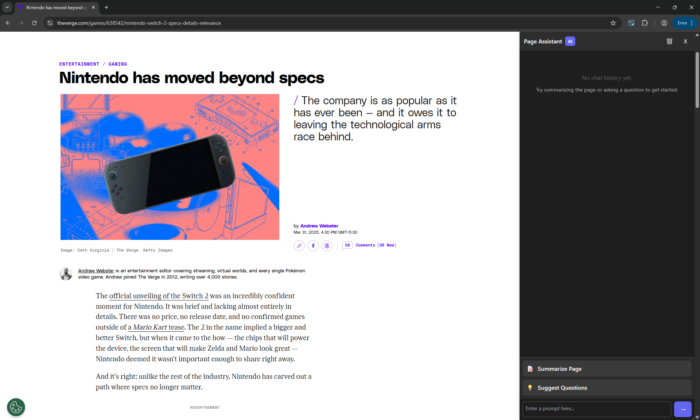
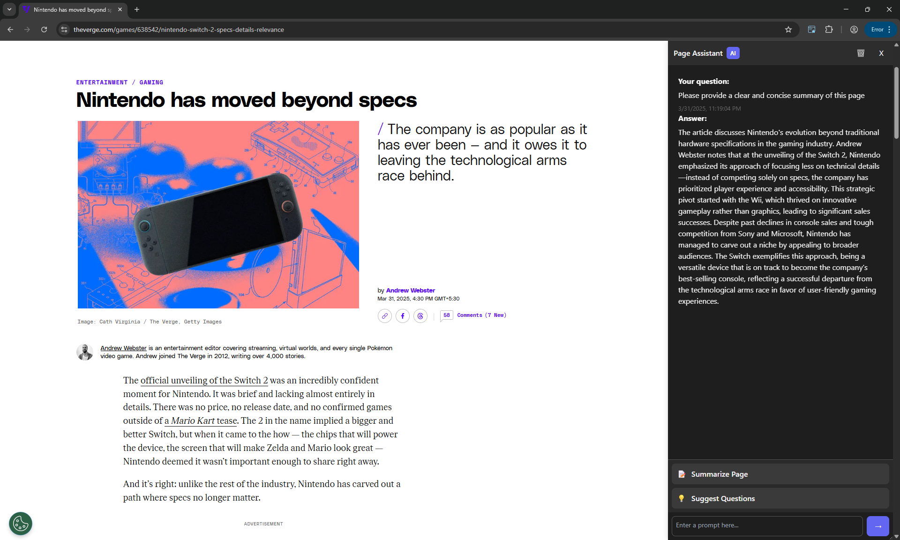
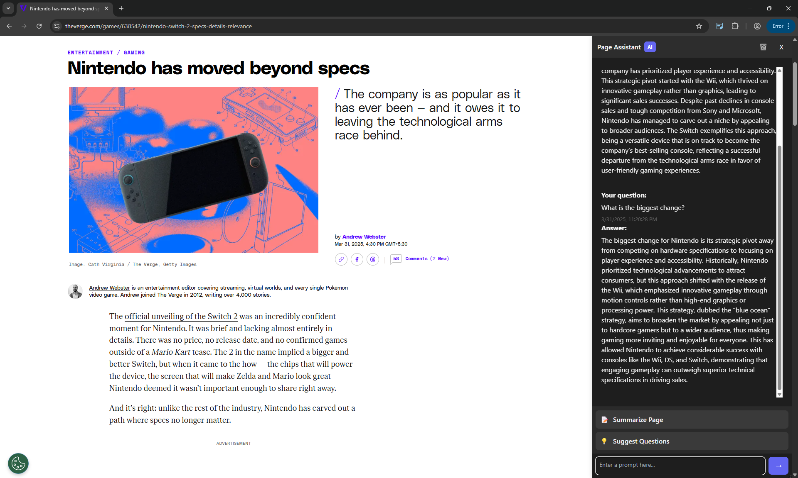

# Page Assistant Chrome Extension

A powerful Chrome extension that provides AI-powered analysis and interaction with web page content using OpenAI's GPT models.

## Features

- 📝 **Page Summarisation** – Get instant summaries of any webpage  
- 💬 **Interactive Chat** – Ask questions about the page content  
- 📚 **Chat History** – View and manage your conversation history  
- 🤔 **Question Suggestions** – Get AI-generated relevant questions about the content  
- ↔️ **Resizable Sidebar** – Customise the viewing experience with a draggable sidebar  
- 🎨 **Clean UI** – Modern and intuitive user interface  

## Screenshots

### Main UI 


### Page Summarisation  


### Interactive Chat  



## Installation

1. Clone this repository:

    ```bash
    git clone https://github.com/haridhayal11/page-assistant-extension
    ```

2. Open Chrome and navigate to `chrome://extensions/`  
3. Enable **Developer mode** in the top right  
4. Click **Load unpacked** and select the extension directory  

## Configuration

Before using the extension, you need to add your OpenAI API key:

- Open `background.js`  
- Replace `'your-api-key-here'` with your actual OpenAI API key:

    ```javascript
    const apiKey = 'your-api-key-here';
    ```

## Usage

- Click the extension icon in your browser toolbar to open the sidebar  
- Use the following features:
  - Click **Summarise Page** to get a quick summary  
  - Click **Suggest Questions** to see relevant questions about the content  
  - Use the chat input to ask specific questions about the page  
  - View your chat history in the main sidebar area  
  - Clear history using the **Clear History** button  

## Technical Details

The extension consists of three main components:

- `background.js`: Handles API communication with OpenAI  
- `content.js`: Manages the sidebar UI and page interactions  
- `sidebar.css`: Styles the sidebar interface (not shown in current files)  

## Dependencies

- Chrome Extension APIs  
- OpenAI API (GPT-4o-mini model)  

## Privacy

The extension sends only the first 5000 characters of page content to OpenAI for analysis. No personal data is stored except for local chat history, which can be cleared at any time.

## Contributing

Contributions are welcome! Please feel free to submit a Pull Request.

## License

MIT License

## Support

If you encounter any issues or have questions, please open an issue in the GitHub repository.

> **Note**: This extension requires an OpenAI API key to function. Make sure to keep your API key secure and never commit it to version control.
